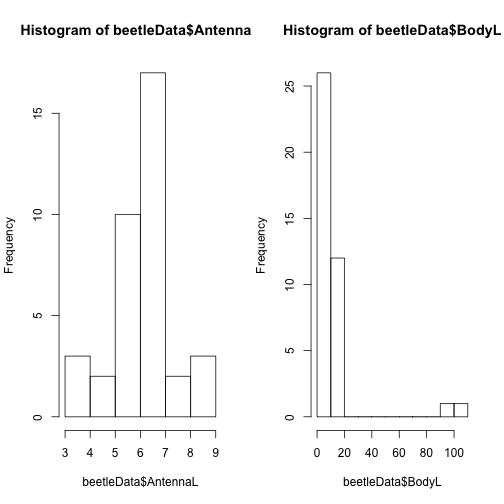
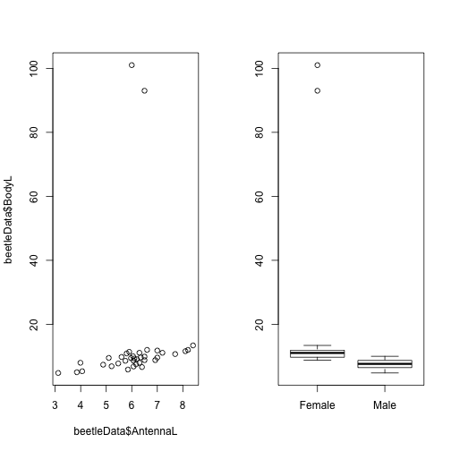

BB817 - Planning and evaluation of biological experiments
-------------------------
  
  
Tidying data
========================================================
  
  *Owen R. Jones*  
  _jones@biology.sdu.dk_

------

### Scenario

Your colleague has sent you some data for analysis. She tells you that the data have just been compiled and that there may be a few errors. The data concern the sizes of individual beetles in relation to sex and genotype. It is common that there are several related datasets involved in a project. In this case, there are two datasets: one concerns the physical measurements of the insects taken by your colleague, the other concerns the genotype analysis which was performed by a different collaborator. For analysis it is useful to combine these datasets in a way that makes them easy to analyse. Your task is to prepare the data for analysis using **R**, and to output a **CSV** file. 

This worksheet will guide you through simple approaches to first "tidy" the data to get rid of obvious errors, and second to merge the two data sets into a single dataframe for analysis.


### Overview of the data


Let's first import the data. There are two files:

```r
genotype <- read.csv("genotype.csv", header = T)
beetleData <- read.csv("beetleData.csv", header = T)
```


There are several functions to examine the data. These include **names** which will tell you the variable (column) names:


```r
names(beetleData)
```

```
> [1] "uniqueID" "Sex"      "AntennaL" "BodyL"
```


The function **dim** will tell you the dimensions of the data (although this information is also given in the workspace window of RStudio (top right)):


```r
dim(beetleData)
```

```
> [1] 40  4
```


* Try this on the genotype data. Notice that it looks like there are 2 individuals with missing data. We'll come back to that.


The **summary** function will give a summary information. It will show the minimum, maximum, median, mean and 1st and 3rd quartiles for continuous data; and it will show the number of records in thefirst few levels for categorical data. It will also indicate the number of missing (*NA*) data points.


```r
summary(beetleData)
```

```
>     uniqueID        Sex        AntennaL      BodyL       
>  Min.   : 1.0   female: 1   6.5    : 3   Min.   :  4.79  
>  1st Qu.:10.8   Female:19   6.07   : 2   1st Qu.:  7.70  
>  Median :20.5   male  : 2   6.3    : 2   Median :  9.37  
>  Mean   :20.5   Male  :18   7      : 2   Mean   : 13.44  
>  3rd Qu.:30.2               3.12   : 1   3rd Qu.: 11.03  
>  Max.   :40.0               (Other):28   Max.   :101.00  
>                             NA's   : 2
```


For categorical data, it is useful to use the **table** function to get a breakdown of the number in each category. This can often highlight problems with the data:


```r
table(beetleData$Sex)
```

```
> 
> female Female   male   Male 
>      1     19      2     18
```

For example, here you can see that there are some errors with the "sex" variable. We'll come back to this in a moment.

* Use **summary** and **table** to look at the genotype data. 

For continuous data (e.g. length, height) it is often useful to look at the individual summaries:


```r
summary(beetleData$BodyL)
```

```
>    Min. 1st Qu.  Median    Mean 3rd Qu.    Max. 
>    4.79    7.70    9.37   13.40   11.00  101.00
```


You may have already noticed this from the results of the **summary** function above, but there may be a problem with one of the continuous variables (AntennaL):


```r
summary(beetleData$AntennaL)
```

```
>    3.12    3.85    3.99    4.06    4.88     5.1    5.21    5.47     5.6 
>       1       1       1       1       1       1       1       1       1 
>    5.75     5.8    5.85     5.9    5.97       6    6.05    6.07     6.1 
>       1       1       1       1       1       1       1       2       1 
>    6.17     6.2     6.3    6.35     6.4     6.5     6.6    6.92       7 
>       1       1       2       1       1       3       1       1       2 
>     7.2     7.7     8.1     8.2     8.4 Unknown    NA's 
>       1       1       1       1       1       1       2
```


Hmmm. This does not look right: it seems like **R** is treating the antennae length data as a categorical variable. The reason for this is that **R** assumes that any variable with non-numerical elements (except "*NA*") is categorical. If you look at the summary above you can see that one of the missing values is incorrectly encoded in the data set. It was recorded as "Unknown" rather than *NA*. This is a common problem.

In the next couple of sections we'll look at how to use **R** to fix the probems that we found when taking an overview of the data.


### Fixing incorrect factor levels

R is case sensitive. In other words, the name "Male" would be treated as different from "male". This becomes important if you have typos in categorical data. Lets look at the sex variable in the budData again. Here I use the **levels** command to ask R what the factor levels are for the variable:


```r
levels(beetleData$Sex)
```

```
> [1] "female" "Female" "male"   "Male"
```


It is clear here that there has been some inconsistency in entering the data. Sometimes the data starts with an upper-case letter, other times with a lower-case letter. You could easily go to the CSV file and correct this, but this becomes more troublesome as the amount of data grows. Luckily, **R** is very good in these situations and can fix the names with a single line of code which renames the factor levels (note that the order of the factor levels is important. The new names must be given in the same order as they appear with the **levels** function above (alphabetically).:


```r
levels(beetleData$Sex) <- c("Female", "Female", "Male", "Male")
```

I can now use the **table** function to confirm that the correction has been applied. It confirms that the number of males and females is now correct:


```r
table(beetleData$Sex)
```

```
> 
> Female   Male 
>     20     20
```


### Fixing incorrect coding of missing values

By default, R expects missing values to be coded as **NA**. Other stats packages may have different coding schemes, for example a single decimal point ".", or a space " ", or "-999.99". Other data may record things like "None" or "Not measured", "Unknown" etc. Therefore, when you import data into R it is worth checking the data for these values. If you recall the data for antenna length there was an issue. Let's look again:


```r
summary(beetleData$AntennaL)
```

```
>    3.12    3.85    3.99    4.06    4.88     5.1    5.21    5.47     5.6 
>       1       1       1       1       1       1       1       1       1 
>    5.75     5.8    5.85     5.9    5.97       6    6.05    6.07     6.1 
>       1       1       1       1       1       1       1       2       1 
>    6.17     6.2     6.3    6.35     6.4     6.5     6.6    6.92       7 
>       1       1       2       1       1       3       1       1       2 
>     7.2     7.7     8.1     8.2     8.4 Unknown    NA's 
>       1       1       1       1       1       1       2
```


It is clear that what we need to do is (1) recode the "*Unknown*" correctly as *NA* and (2) ensure that the data are treated as a continuous rather than categorical variable. Let's deal with the NA/Unknown coding first. We can use the subsetting square brackets **[]** to specify that *"values of 'Unknown', in our vector, should be replaced with NA"*:


```r
beetleData$AntennaL[beetleData$AntennaL == "Unknown"] = NA
```


Let's check that it has worked:

```r
summary(beetleData$AntennaL)
```

```
>    3.12    3.85    3.99    4.06    4.88     5.1    5.21    5.47     5.6 
>       1       1       1       1       1       1       1       1       1 
>    5.75     5.8    5.85     5.9    5.97       6    6.05    6.07     6.1 
>       1       1       1       1       1       1       1       2       1 
>    6.17     6.2     6.3    6.35     6.4     6.5     6.6    6.92       7 
>       1       1       2       1       1       3       1       1       2 
>     7.2     7.7     8.1     8.2     8.4 Unknown    NA's 
>       1       1       1       1       1       0       3
```

We can see here that it *has* worked (there are now 0 records with a value of Unknown, and there is one more NA value). However, we now need to coerce the data to be a continuous numerical variable rather than a categorical one. This is done using two commands **as.numeric** and **as.character**. It is slightly counterintuitive in **R**: you cannot simply use **as.numeric** because it simply changes the values to change to  rank values (integers) (i.e. the lowest value would get "1", the next one, "2" and so on). Instead, you must *first* coerce the vector to be a *character* vector, *then* coerce that to be a numeric vector. In practice it is best to do this in a single line of code by 'wrapping' one command with the other:


```r
beetleData$AntennaL <- as.numeric(as.character(beetleData$AntennaL))
summary(beetleData$AntennaL)
```

```
>    Min. 1st Qu.  Median    Mean 3rd Qu.    Max.    NA's 
>    3.12    5.75    6.10    6.09    6.50    8.40       3
```

You can now confirm that this has worked:

```r
summary(beetleData$AntennaL)
```

```
>    Min. 1st Qu.  Median    Mean 3rd Qu.    Max.    NA's 
>    3.12    5.75    6.10    6.09    6.50    8.40       3
```


### Fixing dodgy numerical values

Data entry errors are, unfortunately, not unusual. In some cases they can be due to mistyping a decimal point (putting it in the wrong place, or omitting it). In other cases it can be harder to see what the problem was, but it is obvious that the data point is wrong. 

Plotting historgrams to look at the frequency distribution of continuous data is useful for checking for these kind of errors (Figure 1):


```r
par(mfrow = c(1, 2))
hist(beetleData$AntennaL)
hist(beetleData$BodyL)
```

 


It looks like the antenna length data are OK because there are no outliers. However, the body length data appears to have some outliers that are an order of magnitude larger than the bulk of the data. An alternative approach would be to plot pairs ofvariables against each other (Figure 2):


```r
par(mfrow = c(1, 2))  #Return R to plotting a single plot per page
plot(beetleData$AntennaL, beetleData$BodyL)
plot(beetleData$Sex, beetleData$BodyL)
```

 


In this case, the best procedure would be to go back to the original data. You can then  correct the 'raw' data file and reimport it. Where the original data are unavailable you may have to convert these values into *NA* values. In this case, however assume you are able to go back to the original paper records and confirm that there was a data entry error with the decimal point being shifted one place to the right. 

Sometimes it is useful to be able to correct the data *in* R. In this case you could do that using a similar procedure to the correction of the missing values above. We first create a temporary vector called *temp1* containing values larger than 80 (we take this value from the figure). Then we use the subsetting approach to replace those values with values one tenth of the size:


```r
temp1 <- which(beetleData$BodyL > 80)
beetleData$BodyL[temp1] = beetleData$BodyL[temp1]/10
```


Note that this approach should be used with care because the script will now replace *all* values that match the criteria given. If new data are added that legitimately match the criteria, then you could wrongly "correct" your data by accident. I advise to correct the individual values on the raw data after checking the original paper records.


If there are many columns of data the **pairs** function can be a useful timesaver to look for oddities in your data. As it's name suggests it plots every possible pair of variables. Since we are using it on data we have already tidied, it shows that everything looks OK (Figure 3):


```r
pairs(beetleData)
```

 


### Merging two data frames

Now you have tidied up the *beetleData* data frame, and examined the genotype data frame for obvious errors, you can merge the two. What we want to do is ensure that the genotype data for each unique individual is correctly assigned to them. In **R** this is accomplished with the **merge** function. The three main arguments are the names of the two data frames you wish to merge, and the name of the column which is used for merging (in this case, *UniqueID*). 

By default, the merge command will only include data that appear in both data sets. For example, if you did not take genotype information from a some individuals, the default behaviour would remove these individuals from the dataset:


```r
newData <- merge(beetleData, genotype, by = "uniqueID")
```


Compare the dimensions of the basic data with the new dataframe:


```r
dim(beetleData)
```

```
> [1] 40  4
```

```r
dim(newData)
```

```
> [1] 38  5
```


You can see that the new data frame only has 38 rows while the beetleData dataframe has 40. This is due to the default behaviour of **merge** described above; because the genotype data includes only 38 of the 40 individuals, the missing individuals have been excluded from the merged data. This is annoying, so to fix this problem you must specify that you wish to keep *all* data using the *all = TRUE* argument. Missing data will be replaced with NA values:


```r
newData <- merge(beetleData, genotype, by = "uniqueID", all = TRUE)
```


We can use **dim** again to check that the dimensions look OK this time:


```r
dim(newData)
```

```
> [1] 40  5
```


That looks OK, but let's take a look at the summary information in any case:


```r
summary(newData)
```

```
>     uniqueID        Sex        AntennaL        BodyL       genotype 
>  Min.   : 1.0   Female:20   Min.   :3.12   Min.   : 4.79   AA  :10  
>  1st Qu.:10.8   Male  :20   1st Qu.:5.75   1st Qu.: 7.70   aB  :13  
>  Median :20.5               Median :6.10   Median : 9.30   Ab  : 8  
>  Mean   :20.5               Mean   :6.09   Mean   : 9.08   BB  : 7  
>  3rd Qu.:30.2               3rd Qu.:6.50   3rd Qu.:10.75   NA's: 2  
>  Max.   :40.0               Max.   :8.40   Max.   :13.40            
>                             NA's   :3
```


There are no extreme outliers, and no odd factor levels. Everything looks good here! 

### Write out the data.

Now the final job is to save the data out to a new CSV file. Here I write out the data to a file called "processedData.csv", I use the argument *row.names = FALSE* to specify that I don't want to include row names (these are just the number of each row and are not meaningful for data analysis).


```r
write.csv(newData, "processedData.csv", row.names = FALSE)
```


