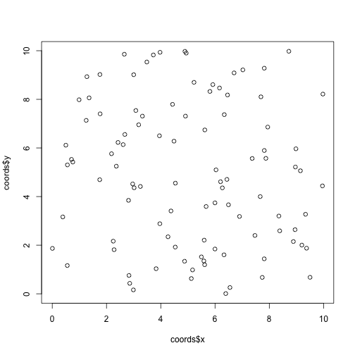
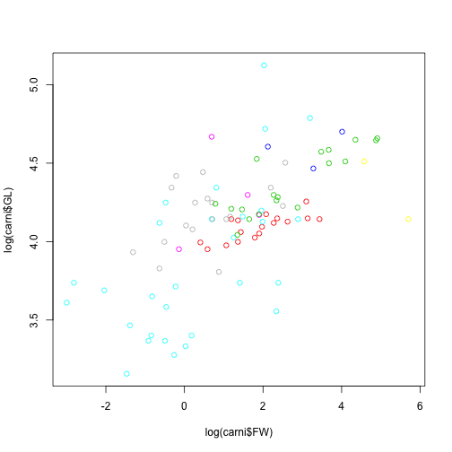
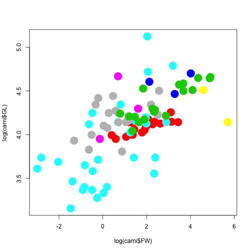
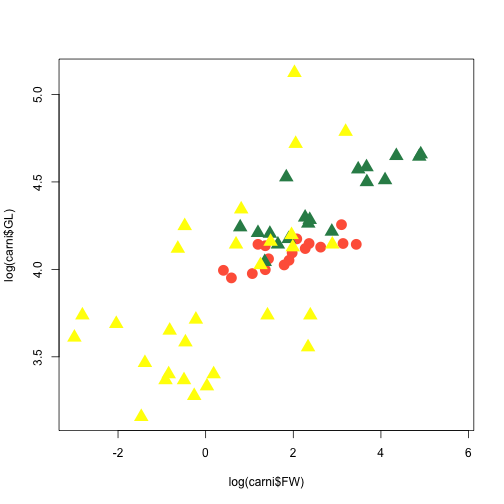
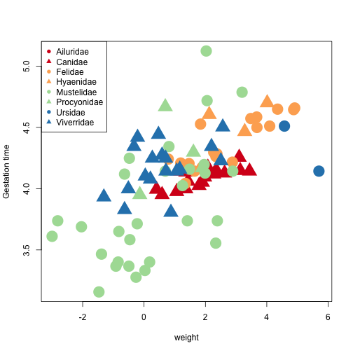
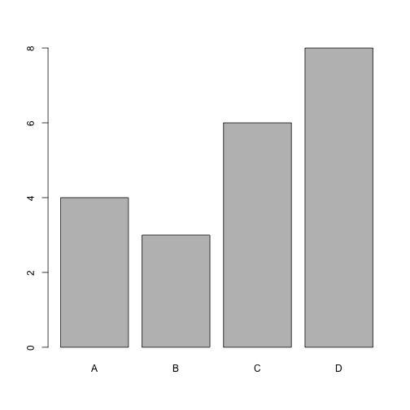
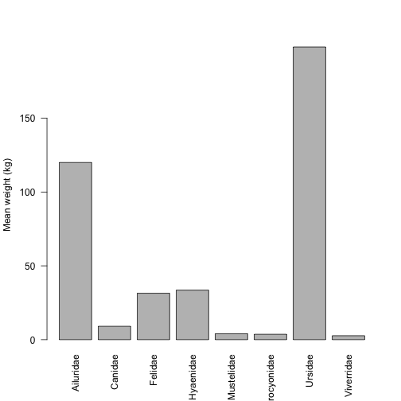
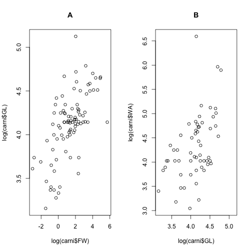

BB817 - Planning and evaluation of biological experiments
-------------------------


Introduction to R - Part 2/2
========================================================

*Owen R. Jones*  
_jones@biology.sdu.dk_

------

In this session we'll look into some more sophisticated programming operations including sorting/ordering data, sampling/resampling, loops, and control functions. We will also look in a bit more detail at plotting data. Work through this handout and try altering the commands to get a better understanding of how they work. It is best to do all of this in the RStudio script window (top left). Remember to save your work if you want to keep it for later!


Ranking, sorting, and ordering a data frame
-------------------------

Sorting, ranking, and ordering are related concepts that are useful when handling data frames. They are implemented using the functions **sort**, **rank** and **order**. I will illustrate what they do using data set called "*birds.csv*" (it is on Blackboard). This is a small dataset of some of the maximum recorded lifespans in years for European birds. 

First, download the data to your working directory and import the data using *read.csv*. Remember to first set your working directory using the **setwd** function.


```r
birds <- read.csv("birds.csv", header = TRUE)
birds
```

```
>         EnglishName                 Species Lifespan
> 1              Wren Troglodytes troglodytes        7
> 2         Bullfinch       Pyrrhula pyrrhula        9
> 3       Sand martin         Riparia riparia        8
> 4         Great tit             Parus major       14
> 5          Barn owl               Tyto alba       15
> 6              Rook       Corvus frugilegus       23
> 7           Goshawk      Accipiter gentilis       19
> 8      Black Grouse           Tetrao tetrix        4
> 9       Common tern          Sterna hirundo       33
> 10          Buzzard             Buteo buteo       26
> 11 Purple sandpiper       Calidris maritima       14
> 12  Manx shearwater       Puffinus puffinus       50
```


To see what ranking, sorting and ordering do, lets create a data frame using the three functions:


```r
ranks <- rank(birds$Lifespan)
sorted <- sort(birds$Lifespan)
ordered <- order(birds$Lifespan)

birdData <- data.frame(Species = birds$Species, Lifespan = birds$Lifespan, ranks, 
    sorted, ordered)
birdData
```

```
>                    Species Lifespan ranks sorted ordered
> 1  Troglodytes troglodytes        7   2.0      4       8
> 2        Pyrrhula pyrrhula        9   4.0      7       1
> 3          Riparia riparia        8   3.0      8       3
> 4              Parus major       14   5.5      9       2
> 5                Tyto alba       15   7.0     14       4
> 6        Corvus frugilegus       23   9.0     14      11
> 7       Accipiter gentilis       19   8.0     15       5
> 8            Tetrao tetrix        4   1.0     19       7
> 9           Sterna hirundo       33  11.0     23       6
> 10             Buteo buteo       26  10.0     26      10
> 11       Calidris maritima       14   5.5     33       9
> 12       Puffinus puffinus       50  12.0     50      12
```


The **rank** function gives the value that is the *rank* of the particular data point where 1 is the lowest value. Thus, the lowest value of Lifespan (4) is given the lowest rank (1), while the highest value of Lifespan (50) is given the highest rank (12). Note that, where there are ties, a fractional rank is given. In this case there are two species with a lifespan of 14, and their ranks are 5 and 6. Because they are tied they are given the average of these two ranks.

The **sort** function behaves the same as the Excel sort command. It will simply sort the values of Lifespan (or whatever) into ascending order. Note that, as in Excel, sort is potentially a dangerous function so use because it decouples the values of a vector from those of a neighbouring vectors.

The **order** function is the most useful, but is a little difficult to understand at first. It returns an integer vector that contains *the permutation that would put the input into ascending order*. 

To understand this, consider the *birds* data frame and ask yourself which row should appear at the top if you put the species in order of ascending Lifespan. You should see that the Black Grouse (*Tetrau tetrix*) has the shortest lifespan (4yrs) and appears in the 8th row of the data frame. Therefore, row number 8 should appear first. What should the second row be? You should see that the Wren (*Troglodytes troglodytes*), with a lifespan of 7yrs, should be in the 2nd row and that it is currently in row 1. And so on...

This function is particularly useful to sort data frames by vectors within them. To sort *birds* by *Lifespan* you can use the square bracket notation like this:


```r
birds[order(birds$Lifespan), ]
```

```
>         EnglishName                 Species Lifespan
> 8      Black Grouse           Tetrao tetrix        4
> 1              Wren Troglodytes troglodytes        7
> 3       Sand martin         Riparia riparia        8
> 2         Bullfinch       Pyrrhula pyrrhula        9
> 4         Great tit             Parus major       14
> 11 Purple sandpiper       Calidris maritima       14
> 5          Barn owl               Tyto alba       15
> 7           Goshawk      Accipiter gentilis       19
> 6              Rook       Corvus frugilegus       23
> 10          Buzzard             Buteo buteo       26
> 9       Common tern          Sterna hirundo       33
> 12  Manx shearwater       Puffinus puffinus       50
```


To do a reverse sort, you can use the **rev** function, which reverses the vector produced by **order**:


```r
birds[rev(order(birds$Lifespan)), ]
```

```
>         EnglishName                 Species Lifespan
> 12  Manx shearwater       Puffinus puffinus       50
> 9       Common tern          Sterna hirundo       33
> 10          Buzzard             Buteo buteo       26
> 6              Rook       Corvus frugilegus       23
> 7           Goshawk      Accipiter gentilis       19
> 5          Barn owl               Tyto alba       15
> 11 Purple sandpiper       Calidris maritima       14
> 4         Great tit             Parus major       14
> 2         Bullfinch       Pyrrhula pyrrhula        9
> 3       Sand martin         Riparia riparia        8
> 1              Wren Troglodytes troglodytes        7
> 8      Black Grouse           Tetrao tetrix        4
```


You can see in both of these cases that the original row names are preserved in the new data frame.


Sampling and randomisation
-------------------------

Sampling and randomisation will come up in some statistics lectures later on, but they are very simple to implement in R. They can be useful in *permutation tests* (which will likely come up later in the course), a class of non-parametric statistics, but are also useful in designing experiments. For example, one could use them to randomly assign treatments, or to randomly determine the location of quadrats.

In R, you can use the function **sample** in its simplest form to randomise a vector: 


```r
x <- 1:6
sample(x)
```

```
> [1] 1 3 6 2 5 4
```


If you want to specify how many random samples to take, you can do so with the *size* argument. 

For example, I could simulate the roll of a 6-sided dice using **sample** like this:


```r
x <- 1:6
sample(x, 1)
```

```
> [1] 6
```


I could simulate the multiple rolls of the dice like this. Where multiple samples are taken you must can specify whether or not the sampling is done with replacement (i.e. whether the same element be drawn more than once) using the *replace* argument. The default behaviour is *replace=TRUE*. You can see what this means in practice by checking what happens when you set *replace=TRUE* or *replace=FALSE*. 


```r
sample(x, 6, replace = FALSE)
```

```
> [1] 2 3 4 5 6 1
```

```r
sample(x, 6, replace = TRUE)
```

```
> [1] 5 4 5 4 3 5
```


What happens if you run the following command? Can you see why?

```r
sample(x, 10, replace = FALSE)
```


The sampling function is great for certain tasks, but what if you want to sample from a continuous distribution. For example, to select a random distance between two points, or to produce a random x/y-coordinate for a sampling design. In this case, the **runif** function is useful. **runif** selects random numbers from between specified minimum and maximum values.

For example, here I first generate 5 random numbers between 0 and 1. Then I generate a single random number between 1000 and 2000.


```r
runif(n = 5, min = 0, max = 1)
```

```
> [1] 0.3455 0.5337 0.3565 0.5319 0.3860
```

```r
runif(1, 1000, 2000)  #Note: you needn't be explicit with arguments if order is correct.
```

```
> [1] 1651
```


It is easy to use these functions to create data frames of random coordinates or treatments. For example, here I create a dataframe called "coords" containing random *x-* and *y-* coordinates before plotting them (Figure 1).


```r
coords <- data.frame(x = runif(100, 0, 10), y = runif(100, 0, 10))
plot(coords$x, coords$y)
```

 


Control functions
-------------------------

It is often desirable to dynamically control what your R program does. R accomplishes this using a set of control functions **if**, **else**, **ifelse**, **for** loops and **while** loops. **if**, **else**, and **ifelse** are the easiest of these. **ifelse** evaluates a logical condition and does one thing if that condition is TRUE, and another thing if it is FALSE.

For example, I could use **ifelse** to replace any instances where the elements in a vector fail to match a certain criterion. In the following code, I tell R to replace all elements of the vector x that are less than 8 with 0:


```r
x <- c(1, 7, 3, 8, 45, 6, 9, 4)
ifelse(x < 8, x, 0)
```

```
> [1] 1 7 3 0 0 6 0 4
```

* Try altering the condition, for example, to x>8. Can you see what happens?

The two functions **if** and **else** are very similar to **ifelse** but work slightly differently. **if** can be used on its own to make R only execute code if a certain logical condition is met. Below, for example, I tell R to print "*Hello world!*" to the screen using the **cat** command, but only if the variable x is TRUE. 


```r
x <- TRUE
if (x == TRUE) cat("Hello world!")
```

```
> Hello world!
```

* What happens if you change x to be FALSE?

You can use **if** in combination with **else** to make a more complicated argument. In this case, I tell R to  print "*Hello world!*" to the screen using if x is TRUE, but to print "*Goodbye!*" if it is not:


```r
x <- FALSE
if (x == TRUE) cat("Hello world!") else cat("Goodbye!")
```

```
> Goodbye!
```

* What happens if you change x to be TRUE?


**For Loops** are useful to make R carry out the same task many times. This is useful for simulation, among other things. 

The general structure of a **for** loop is:


```r
for (counter in vector) {commands}
```


For example, the following will print (using the **cat** function). The "\\n" syntax is simply to tell R to a new line:


```r
for (i in 1:5) {
  cat(i,"\n")
  } 
```

```
> 1 
> 2 
> 3 
> 4 
> 5
```


Lets try a more complicated example and use R to simulate a dice game. In this game you start with 100Kr, and each time you roll a dice, if you roll a 1, 2 or 3 I give you 10Kr, otherwise you give me 10Kr. Lets assume that you play for 50 turns.

Look at the code below: I start off defining *money* as 100 (because that's how much we start with). Then I make a loop which runs for 50 iterations (one for each roll of the dice). On each iteration I use **sample** to simulate a dice roll and use the **if/else** functions to either add or subtract 10Kr from *money* depending on the result of the dice roll.


```r
money <- 100
for (i in 1:50) {
    if (sample(1:6, 1) %in% 1:3) {
        money = money + 10
    } else {
        money <- money - 10
    }
}
```

*Note that you can split commands between multiple lines of text as long as they are located between the curly brackets { }.*

Now I can run this and look at the amount of *money* I have at the end of the 50 throws of the dice [*Note that you will get different results to me because this is a random process.*]:


```r
money
```

```
> [1] 260
```

Further examples of this kind of thing, including examples where you can track and plot the outcome of each iteration are given in the "Loops" PDF on Blackboard. *This is optional, but some of you might find it useful or interesting!*

Plotting
-------------------------

**Scatter plots**

Let's return to the carnivora dataset and explore how to improve on the basic scatter plots. First read in the data:


```r
carni <- read.csv("carnivora.csv", header = TRUE)
```


One of the basic plots we produced in the last session was of log female body weight vs. log gestation time. We plotted this using the basic plotting function:


```r
plot(log(carni$FW), log(carni$GL))
```


However, there are 8 taxonomic Families represented in this dataset, so it would be useful to be able to identify which to which Family each point belongs. This can be done in a number of ways. The easiest is to tell R to change the colour of the point depending on the Family. 

Colours in R can be chosen in several ways: using numbers, by name, or using a 'Hex code' [see: http://www.december.com/html/spec/color.html]. R has a set of 8 simple colours that can be referred to simply by number. For example, I could make the points red using the argument *col = 2*. 


```r
plot(log(carni$FW), log(carni$GL), col = 2)
```


* Try changing the *col* argument to any integer between 1 and 8.

The same result can be achieved using the name of the colour:


```r
plot(log(carni$FW), log(carni$GL), col = "red")
```

* Try some other colour names (e.g. "blue", "black" etc).


There are many (657!) weird and wonderful colours that you can call by name. I have put a PDF called 'Colours in R' on Blackboard which has a list. You can also see the full list by running the following command:


```r
colours()
```


You can also call these colours by using the **colours** function combined with square brackets to refer to their number. For example, these two lines would produce exactly the same result:


```r
plot(log(carni$FW), log(carni$GL), col = "tomato")
plot(log(carni$FW), log(carni$GL), col = colours()[630])
```


Returning to the carnivore data: Family is of Class *factor* (i.e. it is a categorical variable) and has 8 levels. If we tell the plot command to colour-code the points by *Family* you will see that something clever happens: R turns the categorical variable into a numeric vector. The levels are taken in alphabetical order and the first level, '*Ailuridae*', gets colour 1 (black); the second level, '*Canidae*', gets colour 2, and so on (see Figure 2).


```r
plot(log(carni$FW), log(carni$GL), col = carni$Family)
```

 


Those points are a bit hard to see so we can change them using the *pch = x* argument(*pch* stands for "plotting character"), and make them slightly bigger with the *cex = x* argument (*cex* stands for "character expansion"). For example (Figure 3):


```r
plot(log(carni$FW), log(carni$GL), col = carni$Family, pch = 16, cex = 3)
```

 


* Explore what the other plotting characters are by altering the *pch* to any integer between 1 and 26, and explore what happens when you alter the *cex* argument (e.g. try values of 0.5 or 5)

The colours are a bit ugly. One way to make them prettier is to specify a particular colour for each Family individually. To do this you must first specify an empty plot (using the *type = "n"* argument), and then add each set of points using the **points** function. Here I do it for 3 Families (Figure 4):


```r
plot(log(carni$FW), log(carni$GL), type = "n")  # Create an empty plot area
points(log(carni$FW[carni$Family == "Canidae"]), log(carni$GL[carni$Family == 
    "Canidae"]), col = "tomato", pch = 16, cex = 2)
points(log(carni$FW[carni$Family == "Felidae"]), log(carni$GL[carni$Family == 
    "Felidae"]), col = "seagreen", pch = 17, cex = 2)
points(log(carni$FW[carni$Family == "Mustelidae"]), log(carni$GL[carni$Family == 
    "Mustelidae"]), col = "yellow", pch = 17, cex = 2)
```

 


I usually like to do this in a **for** loop. Note the use of the *xlab* and *ylab* arguments to specify the axis titles, and the use of hexcodes to specify the point colour (Figure 5):


```r
colVals = rep(c("#D7191C", "#FDAE61", "#ABDDA4", "#2B83BA"), each = 2)
pchVals = rep(c(16, 17), 4)  # a vector of symbol types
famVals = levels(carni$Family)  # a vector of Family names
plot(log(carni$FW), log(carni$GL), type = "n", xlab = "weight", ylab = "Gestation time")
for (i in 1:8) {
    points(log(carni$FW[carni$Family == famVals[i]]), log(carni$GL[carni$Family == 
        famVals[i]]), col = colVals[i], pch = pchVals[i], cex = 3)
}
```

 


You can add a legend using the **legend** function. The syntax here is to first specify the location, then the text for the labels, then the colours and symbols:


```r
legend("topleft", famVals, col = colVals, pch = pchVals)
```


**Bar plots**

Bar plots are far simpler! The basic command is, not surprisingly, **barplot**, and there is a **names.arg** to specify the column names (Figure 6):


```r
barplot(c(4, 3, 6, 8), names.arg = c("A", "B", "C", "D"))
```

 


The **barplot** function can take the output of the **tapply** summarising function  to easily produce summary plots. Note here the use of the *las = 2* argument which tells R to rotate the labels by 90 degrees so that they will fit, and the **title** function to add a y-axis label to the plot (Figure 7):


```r
famMean <- tapply(carni$FW, carni$Family, FUN = mean)
barplot(famMean, names.arg = names(famMean), las = 2)
title(ylab = "Mean weight (kg)")
```

 


**Multiple plots per page**

You can place multiple plots on a single figure using the **mfrow=c(nrows, ncols)** command before you make the plots. This tells R to set up a plotting area with a certain number of rows and columns. Note the use of the **title** function to add a title after each plot command (Figure 8):


```r
par(mfrow = c(1, 2))  #1 row, 2 columns
plot(log(carni$FW), log(carni$GL))
title("A")
plot(log(carni$GL), log(carni$WA))
title("B")
```

 


**Saving plots**

Saving plots out of RStudio is easy. You first adjust the window size in RStudio until it looks good, then click "Export", then "Save Plot as Image" or "Save Plot as PDF" and follow the prompts.


Try the following
-------------------------

1. Randomly draw 25 numbers from a uniform distribution from 10 to 20. *Hint: use* **runif** 

2. (a) Write a script to simulate flipping a coin. *Hint: you need to* **sample** *from Heads or Tails*. (b) Add **if** and **else** statements to print "Heads - you win!" or "Tails - you lose!" depending on the outcome.

3. Make a scatter plot showing the relationship between log female weight (FW) and litter size (LS) in the *Canidae* and *Felidae* families. Use different colours for the points from each Family. *Hint: you can use* **[]** *(square brackets), like in one of the examples above.*

4.  Using the carnivore data set, make a **barplot** showing the mean birth weight (BW) for the Families in Superfamily *Feliformia*. *Hint: you will need to* **subset** *the data, drop unused factor levels with* **droplevels**, *and then use* **tapply** *to get the means.*


