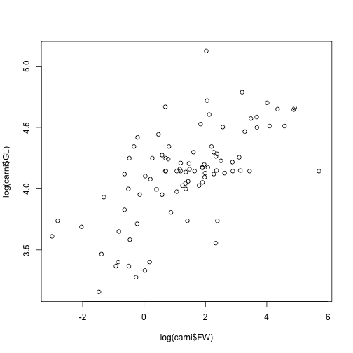
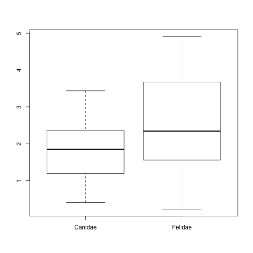

BB839 - Planning and evaluation of biological experiments
-------------------------


Introduction to R - Part 1 of 2
========================================================

*Owen R. Jones*  
_jones@biology.sdu.dk_

------


**R** is a programming language for data analysis and statistics. It is free and very widely used. One of its strengths is its very wide user base which means that there are hundreds of contributed packages for every concievable type of analysis. The aim of these introductory classes is to give a basic introduction to the programming language as a tool for importing, manipulating, and exploring data. There will be very little 'statistics', but you will be doing statistics using R during subsequent lectures.

Before proceeding you will need to ensure you have intalled R and RStudio on your computer.
See the PDF on Blackboard for details.

------


Getting started with R
-------------------------

I encourage you to do all of your coding from within the RStudio IDE. 

In RStudio, create a new "R Script" file. Scripts are essentially programs that can be saved to allow you to return to your work in the future. They also make debugging of errors much easier. You can use the menu to do creat a new R Script, but there's also a keyboard shortcut (Windows: Ctrl+Shift+N; Mac: Cmd+Shift+N ). If you save (Windows: Ctrl+S; Mac: Cmd+S), you will be prompted for a file name. Make sure it has the suffix ".R" which denotes an R script file. When you double click on this file in future, it should automatically open in RStudio.

In RStudio you can execute commands using the "run" icon on the top right of the scripting window (top left), or by selecting the text and typing the shortcut Ctrl+Enter (Windows) or Cmd+Enter (Mac). Another helpful feature of RStudio is that it will colour-code the syntax that you type, making it easier to read and debug. Note that the colours you see may be different from the ones shown in this handout.

Over the next few pages I will introduce the basics of the R programming language. Try typing them into the scripting window (top left) in RStudio and ensuring that you understand what the commands are doing. It is almost impossible to "break" R by typing the wrong command so I encourage you to experiment and explore the R language I introduce to you here as much as possible - it really is the best way to learn!

Getting help
-------------------------

**R** features a wealth of commands, which are more properly termed **functions**. You will learn many of these over the next few weeks. Functions often feature a several options which are specified with **arguments**. For example, the function **sum**, has the argument **...**, which is intended to be a *vector* of numbers (see below), and the argument **na.rm**, which is a logical argument specifying whether or not missing values should be removed or not. Usually the arguments have default options which are used you choose not to specify them. In addition, you don't necessarily need to fully-specify the argument if they are specified in the *correct order*. It is usually best to fully-specify though!


```r
sum(x, na.rm=FALSE)
sum(x) #This will produce exactly the same output as the above.
sum(x, FALSE) #So will this, because the order is correct.
```
You can get **help** on R functions from within R/RStudio with the **?** and **help.search** commands. **?** requires that you know the function name while *help.search* will search all the available help files for a particular word or phrase. **??** is a synonym for *help.search*:


```r
?rep
help.search("bar plot")
??"bar plot"
```


In RStudio, the help results will appear in the lower right hand area.


R as a calculator
-------------------------

R features the usual arithmetic operations for addition, subtraction, division, multiplication: 


```r
4 + 3
```

```
> [1] 7
```

```r
9 - 12
```

```
> [1] -3
```

```r
6/3
```

```
> [1] 2
```

```r
7 * 3
```

```
> [1] 21
```

```r
(2 * 7) + 2 - 0.4
```

```
> [1] 15.6
```

R also has commands for square root (sqrt), raising to powers (\^), taking the absolute value (abs), and rounding (round), natural log (log), antilog (exp), log to base-10 (log10):


```r
sqrt(945)
```

```
> [1] 30.74
```

```r
3^5
```

```
> [1] 243
```

```r
abs(-23.4)
```

```
> [1] 23.4
```

```r
round(2.35425,digits=2)
```

```
> [1] 2.35
```

```r
log(1.2)
```

```
> [1] 0.1823
```

```r
exp(1)
```

```
> [1] 2.718
```

```r
log10(6)
```

```
> [1] 0.7782
```


Objects in R
-------------------------

R is an object oriented programming language. This means that it represents concepts as **objects** that have data fields describing the object. These objects can be manipulated by **functions**. Objects can include data, but also models. Don't worry about these distinctions too much for now - all will become clear as you proceed!

Objects are assigned names in R like this. The "<-" command is pronounced "gets" so I would pronounce the following "x gets four":


```r
x <- 4
```

To look at any object (function or data), just type its name.

```r
x
```

```
> [1] 4
```

The main data object types in R are: *vectors*, *data frames*, *lists* and *matrices*. We will focus on the first two of these during this course.

A vector is simply a series of data (e.g. the sequence _1, 2, 3, 4, 5_ is a vector, so is the non-numeric sequence _M, F, F, M, M_ ). Each item in a vector is termed an **element**. Therefore, both of these examples contain 5 elements.

There are several ways to create vectors in R. For example, you can make vectors of integers using the *colon (:)* argument (e.g. *1:6*), or vectors of any kind of variable using the *c* function. *c* stands for **concatenate** and simply means to *link (things) together in a chain or series*. Other convenient functions for making vectors are **seq**, which builds a sequence of numbers, and **rep** which builds a vector by repeating elements a specified number of times.

Try the following:

```r
A <- 1:5
B <- c(1,3,6,1,7,9)
C <- seq(1,10,2)
D <- seq(1,5,0.1)
E <- rep(c("M","F"),each = 3)
G <- rep(c("M","F"),c(2,4))
```

In these examples, the commands **c**, **seq** and **rep** are *functions*. 

You can *concatonate* vectors using the **c** function. E.g. concatonating the vectors A and B from above:

```r
c(A,B)  
```

```
>  [1] 1 2 3 4 5 1 3 6 1 7 9
```

When functions are applied to vectors, they are applied element-by-element. For example, multiplying a vector will multiply every element in that vector:


```r
B
```

```
> [1] 1 3 6 1 7 9
```

```r
B*3
```

```
> [1]  3  9 18  3 21 27
```

Other manipulations are also done "element-by-element". For example, here we multiply the first element of B by 1, the second by 2, the 3rd by 3 and so on...:


```r
B * c(1,2,3,4,5,6)
```

```
> [1]  1  6 18  4 35 54
```

Missing values, infinity and "non-numbers"
-------------------------

By convention, *missing values* in R are coded by the value "NA". The way that particular functions handle missing values varies: sometimes the NA values are stripped out of the data, other times the function may fail.

For example, if we asked for the mean value of a vector of numbers with an NA value, it will fail:


```r
mean(c(1,3,6,1,7,9,NA))
```

```
> [1] NA
```

In this case you need to specify that any NA values should be removed before calculating the mean:

```r
mean(c(1,3,6,1,7,9,NA),na.rm=TRUE)
```

```
> [1] 4.5
```

Calculations can sometimes lead to answers that are plus, or minus, infinity. These values are represented in R by Inf or -Inf:


```r
5/0
```

```
> [1] Inf
```

```r
-4/0
```

```
> [1] -Inf
```

Other calculations lead to answers that are not numbers, and these are represented by NaN in R:

```r
0/0
```

```
> [1] NaN
```

```r
Inf-Inf
```

```
> [1] NaN
```


Addressing elements from a matrix
-------------------------

Elements from a matrix can be extracted using square brackets as follows:


```r
B[3]
```

```
> [1] 6
```

```r
B[3:5]
```

```
> [1] 6 1 7
```

```r
B[c(1,3,5)]
```

```
> [1] 1 6 7
```

You can also subset the elements using *logical operators*. Logical operators are: **==** (equals), **!=** (not equal), **<** (less than), **>** (greater than), **<=** (less than or equal), **>=** (greater than or equal). For example:


```r
B[B<7]
```

```
> [1] 1 3 6 1
```

```r
B[B<=7]
```

```
> [1] 1 3 6 1 7
```

These logical operators can also be used more simply like this, in which case the output is a **logical vector**:

```r
B<7
```

```
> [1]  TRUE  TRUE  TRUE  TRUE FALSE FALSE
```

```r
B<=7
```

```
> [1]  TRUE  TRUE  TRUE  TRUE  TRUE FALSE
```

Basic information about objects
-------------------------

You can obtain information about most objects using the **summary** function:


```r
summary(B)
```

```
>    Min. 1st Qu.  Median    Mean 3rd Qu.    Max. 
>    1.00    1.50    4.50    4.50    6.75    9.00
```

The functions **max**, **min**, **range**, and **length** are also useful:

```r
max(B)
```

```
> [1] 9
```

```r
min(B)
```

```
> [1] 1
```

```r
range(B)
```

```
> [1] 1 9
```

```r
length(B)
```

```
> [1] 6
```

Data frames
-------------------------

Data frames are the usual way of storing data in R. It is more-or-less the same as a worksheet in Excel. A data frame is usually made up of a number of vectors (of the same length) bound together in a single object. You can make a data frame by binding together vectors, or you can import them from outside R.

This example shows the creation of a data frame in R, from 3 vectors:

```r
height <- c(173, 145, 187, 155, 179, 133)
sex <- c("Male", "Female", "Male", "Female", "Male", "Female")
age <- c(17, 22, 32, 20, 27, 30)

mydata = data.frame(height = height, age = age, sex = sex)
mydata
```

```
>   height age    sex
> 1    173  17   Male
> 2    145  22 Female
> 3    187  32   Male
> 4    155  20 Female
> 5    179  27   Male
> 6    133  30 Female
```

Data frames can be summarised using the **summary** function:

```r
summary(mydata)
```

```
>      height         age           sex   
>  Min.   :133   Min.   :17.0   Female:3  
>  1st Qu.:148   1st Qu.:20.5   Male  :3  
>  Median :164   Median :24.5             
>  Mean   :162   Mean   :24.7             
>  3rd Qu.:178   3rd Qu.:29.2             
>  Max.   :187   Max.   :32.0
```

You can also use **str** function, which gives a different set of summary information - the variable names and types, plus the first few elements of the vectors:

```r
str(mydata)
```

```
> 'data.frame':	6 obs. of  3 variables:
>  $ height: num  173 145 187 155 179 133
>  $ age   : num  17 22 32 20 27 30
>  $ sex   : Factor w/ 2 levels "Female","Male": 2 1 2 1 2 1
```


They can be subsetted using the square brackets **[]**, or **subset** functions. With the square brackets, the first number specifies the row number, while the second number specifies the column number:

```r
mydata[1,]
```

```
>   height age  sex
> 1    173  17 Male
```

```r
mydata[,2]
```

```
> [1] 17 22 32 20 27 30
```

```r
mydata[1,2]
```

```
> [1] 17
```

```r
subset(mydata,sex == "Female")
```

```
>   height age    sex
> 2    145  22 Female
> 4    155  20 Female
> 6    133  30 Female
```

Of course it would be incredibly tedious to enter real data in this way. Thankfully, R can import data from a range of different data formats. The most commonly used data format is **comma separated value (CSV)** so I will use that.

At this point you should create a folder/directory somewhere on your computer called "IntroToR". We will use this as the **working directory** for the remainder of the session. In R you can set the working directory using the **setwd** function. 


Note that file paths in Windows and Apple OSX are expressed differently. Apple systems use the forward-slash (/) to separate folders whereas Windows can use the forward-slash (/) or double-backslash (\\). In windows you also need to define the drive (e.g. C:).

So, to set the working directory in Apple OSX you would use something like this (obviously, you need to put YOUR path!):

```r
setwd("/Users/orj/Desktop/IntroToR")
```
While in Windows the equivalent command would be something like this (both of the following should work):

```r
setwd("C:\\Users\\orj\\Desktop\\IntroToR")
setwd("C:/Users/orj/Desktop/IntroToR")
```

Typing the path in can be annoying but there are ways to speed it up. In Windows you can copy paths from the Windows Explorer location/address bar, or you can hold down the Shift key as you right-click the file, and then choose Copy As Path (this works in Windows 7 at least!).

On a Mac you can right-click and select "Get Info" (or Cmd+I) to bring up summary info about the file/folder: you can select and copy the path from this window. 


I can check what the current working directory is using the **getwd** function:

```r
getwd()
```

On the Blackboard site for BB839 I have put a folder called "Introduction to R". In there you should be able to find a file called "carnivora.csv". Download this to your new working directory. You can check the contents of your working directory with the **list.files** function:


```r
list.files()
```

You can now import this file into R using the **read.csv** function. The specification of the argument **header = TRUE** signifies that the fiest row of our CSV file contains the column names:


```r
carni <- read.csv("carnivora.csv",header = TRUE)
```

We can get some basic information on the *carni* data frame using the **summary** function, but also the **dim** and **nrow/ncol** functions:

```r
summary(carni)
```


```r
dim(carni)
```

```
> [1] 112  17
```

```r
nrow(carni)
```

```
> [1] 112
```

```r
ncol(carni)
```

```
> [1] 17
```

We can find the names of the columns of a data frame with the **names** function:


```r
names(carni)
```

```
>  [1] "Order"       "SuperFamily" "Family"      "Genus"       "Species"    
>  [6] "FW"          "SW"          "FB"          "SB"          "LS"         
> [11] "GL"          "BW"          "WA"          "AI"          "LY"         
> [16] "AM"          "IB"
```
The first few columns are to do with the taxonomic placement of the species (Order, SuperFamily, Family, Genus and Species). There then follow several columns of life history variables: FW = Female body weight (kg),
SW = Average body weight of adult male and adult female (kg), FB = Female brain weight (g), SB = Average brain weight of adult male and adult female (g), LS = Litter size, GL = Gestation length (days), BW = Birth weight (g), WA = Weaning age (days), AI = Age of independance (days), LY = Longevity (months), AM = Age of sexual maturity (days), IB = Inter-birth interval (months).

You can refer to the sub-parts of an object (in this case the columns) using the **$** syntax:


```r
summary(carni$FW)
```

```
>    Min. 1st Qu.  Median    Mean 3rd Qu.    Max. 
>     0.0     1.2     3.4    18.1    10.4   320.0
```

Classes in R
-------------------------

I have already mentioned the different object types in R (e.g. vectors and data frames). The object types are technically known as "classes". You can find out what "class" an object is by using the **class** function:


```r
class(carni)
```

```
> [1] "data.frame"
```

In this case, the data frame is, unsurprisingly, of class "data.frame". However, the vectors that compose the data frame also have classes. There are several classes of vectors including "integer" (whole numbers), "numeric" (real numbers), "factor" (categorical variables) and "logical" (true/false values).

I expect you have heard of the first two data types, but "factor" might be puzzling. Factors are defined as variables which can take on a *limited* number of different values. They are often referred to as **categorical variables**. For example, in the carnivore dataset, the taxonomic variables are factors. The different values that a factor can take are known as **levels** and you can check on the levels of a vector with the **levels** function.


```r
class(carni$Family)
```

```
> [1] "factor"
```

```r
levels(carni$Family)
```

```
> [1] "Ailuridae"   "Canidae"     "Felidae"     "Hyaenidae"   "Mustelidae" 
> [6] "Procyonidae" "Ursidae"     "Viverridae"
```

Tables and summary statistics
-------------------------

For vectors of class "factor" you can use the **table** function to give the counts for each level:


```r
table(carni$Family)
```

```
> 
>   Ailuridae     Canidae     Felidae   Hyaenidae  Mustelidae Procyonidae 
>           1          18          19           4          30           4 
>     Ursidae  Viverridae 
>           4          32
```

You can use the function **tapply** ("table apply"), to get more complex summary information. For example, I could ask what the mean female weight (FW) is in each of the families using the argument **FUN=mean**:


```r
tapply(carni$FW, carni$Family, FUN=mean)
```

```
>   Ailuridae     Canidae     Felidae   Hyaenidae  Mustelidae Procyonidae 
>     120.000       9.050      31.432      33.540       3.989       3.643 
>     Ursidae  Viverridae 
>     198.250       2.673
```


Subsetting a data frame
-------------------------

It is very common that a researcher wants to work with a small part of their data. For example, they might only be interested in some of the treatments, or some species etc. Subsetting a data frame is very easy using the **subset** function:

Subsetting the data frame to only the Canidae:

```r
canids <- subset(carni, Family == "Canidae")
```
Subsetting the data frame to include a number of levels of "Family":

```r
felidsAndCanids <- subset(carni, Family %in% c("Canidae","Felidae"))
```

Note that even though all non felids and canids have been removed from the dataset, the information about the levels is retained in the data frame:


```r
levels(felidsAndCanids$Family)
```

```
> [1] "Ailuridae"   "Canidae"     "Felidae"     "Hyaenidae"   "Mustelidae" 
> [6] "Procyonidae" "Ursidae"     "Viverridae"
```

This can be annoying and the best thing to do is to use the **droplevels** function to remove unused factor levels from the data frame:


```r
felidsAndCanids <- droplevels(felidsAndCanids)
levels(felidsAndCanids$Family)
```

```
> [1] "Canidae" "Felidae"
```


More complex subsets can be built up using logical operators and the **&** (and) symbol. For example, here I subset the data to include only species in the Canidae family that also have a female weight of less than or equal to 10kg:


```r
smallCanids <- subset(carni, Family == "Canidae"&FW<=10)
```

Plotting data
-------------------------

Basic plots can be made using the **plot** command. For example, let's have a look at the relationship between log gestation length and log female body weight (see Figure 1, below):


```r
plot(log(carni$FW), log(carni$GL))
```

 

How about comparing the log female weights between the Canidae and the Felidae (see Figure 2, below)?

```r
plot(felidsAndCanids$Family, log(felidsAndCanids$FW))
```

 

You will see here that R is a *little* bit clever. It knows that Family is a factor variable with 2 levels, so it plots a box and whisker plot (aka a boxplot) instead of trying to plot a scatter plot.


Saving and exporting data from R
-------------------------
You can save out data frames as \*.csv files that can be read by Microsoft Excel (etc.) using the **write.csv** function:


```r
write.csv(smallCanids, file = "smallCanids.csv", row.names = FALSE)
```

Note that the row.names=FALSE argument is to ensure that R does not write the row names (numbers) into the csv file. Take a look at what happens if you omit this argument.

You can also save your entire workspace. This will save everything including all the new objects you have created. You can do this from the RStudio GUI (look in the top right window), or you can use the **save.image** function


```r
save.image("myFirstWorkspace.RData")
```

Sometimes it is useful to only save *some* of the objects. You could do this by first removing the unwanted objects with the **rm** command, or you could list the objects in the **save** command:


```r
save(A,B,C,file = "SomeWork.RData")
```

These RData files can be loaded into RStudio by using the "Open File" icon (look at the top left of RStudio). Or using the **load** function (remember to define the correct working directory first):


```r
load("SomeWork.RData")
```

Load will *add* all of the objects in the RData file to your current work space. It will not delete anything, but it could overwrite existing objects if they have the same names - so be careful!


Next time...
-------------------------


In the next session we'll go into plotting in more detail, and learn about sampling and loops.

*********

Try the following
-------------------------

*Submit your answers electronically via Blackboard in a single Word or PDF document. Show the question, the code used to find the answer, in addition to the answer. Remember to put your name! (see Blackboard for deadline)*

Q1. Make a table of the number of species in each Family of the Superfamily *Caniformia*.

Q2. Using the carnivore data set, produce a box plot featuring female weight (FW) for the *Canidae*, *Felidae* and *Ursidae* together on the same plot. Hint: you will need to use **subset** and **droplevels** before plotting.

Q3. Using the carnivore data set, make a table showing the average (mean) birth weight (BW) for Families in Superfamily *Feliformia*. Hint: Use **subset**, **droplevels** and **tapply**.

Q4. Plot the relationship between log female weight (FW) and litter size (LS) in the *Mustelidae*.

Q5. Identify the largest and smallest (by female weight (FW)) species in the *Viverridae* family. What are their brain sizes (FB)? Hint: use subset and the **which.min**/**which.max** functions (use help), and maybe square brackets [ ].


