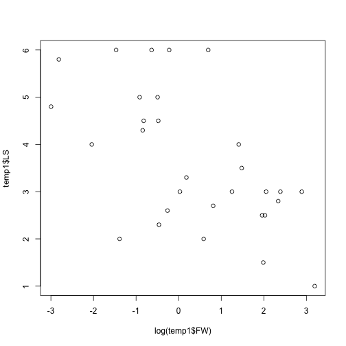

Answers to exercises in Handout 1
========================================================


**Remember:** make sure you have the carnivora data set loaded into your workspace (using *read.csv*) and named *carni*.


Q1. Tabulate the number of species in each Family of the superfamily *Caniformia*.
-----------


```r
temp1 <- subset(carni,SuperFamily == "Caniformia")
temp1 <- droplevels(temp1)
table(temp1$Family)
```

```
> 
>   Ailuridae     Canidae  Mustelidae Procyonidae     Ursidae 
>           1          18          30           4           4
```


Q2. Using the carnivore data set, produce a box plot featuring female weight (FW) for the *Canidae*, *Felidae* and *Ursidae* together on the same plot.
-----------


```r
temp1 <- subset(carni,Family %in% c("Canidae","Felidae","Ursidae"))
temp1 <- droplevels(temp1)
plot(temp1$Family, temp1$FW)
```

 


Q3. Using the carnivore data set, make a table showing the average (mean) birth weight (BW) for Families in Superfamily *Feliformia*. 
-----------


```r
temp1 <- subset(carni,SuperFamily == "Feliformia")
temp1 <- droplevels(temp1)
tapply(temp1$BW, temp1$Family,FUN=mean,na.rm=TRUE)
```

```
>    Felidae  Hyaenidae Viverridae 
>      418.1     1096.5       96.6
```

Q4. Plot the relationship between log female weight (FW) and litter size (LS) in the *Mustelidae*.
-----------


```r
temp1 <- subset(carni,Family == "Mustelidae")
plot(log(temp1$FW),temp1$LS)
```

 


Q5. Identify the largest and smallest (by female weight (FW)) species in the *Viverridae* family. What are their brain sizes (FB)?
-----------


```r
temp1 <- subset(carni,Family == "Viverridae")
which.min(temp1$FW)
```

```
> [1] 27
```

```r
which.max(temp1$FW)
```

```
> [1] 12
```

```r
temp1[c(27,12), ] #You can read off the brain sizes in the FB column
```

```
>        Order SuperFamily     Family      Genus             Species    FW
> 84 Carnivora  Feliformia Viverridae   Helogale    Helogale parvula  0.27
> 69 Carnivora  Feliformia Viverridae Acrctictis Arctictis binturong 13.00
>       SW FB    SB  LS   GL  BW WA AI  LY  AM IB
> 84  0.27  5  4.75 3.6 51.0  NA NA NA  NA 450  4
> 69 13.00 38 40.80 3.0 90.3 319 56 NA 216
```

You could also do it like this:
  

```r
temp1 <- subset(carni,Family == "Viverridae")
x <- c(which.min(temp1$FW),which.max(temp1$FW))
temp1[x, ]
```

```
>        Order SuperFamily     Family      Genus             Species    FW
> 84 Carnivora  Feliformia Viverridae   Helogale    Helogale parvula  0.27
> 69 Carnivora  Feliformia Viverridae Acrctictis Arctictis binturong 13.00
>       SW FB    SB  LS   GL  BW WA AI  LY  AM IB
> 84  0.27  5  4.75 3.6 51.0  NA NA NA  NA 450  4
> 69 13.00 38 40.80 3.0 90.3 319 56 NA 216
```

You can simply look at the output to see that the smallest species (by female weight) is *Helogale parvula* with a brain size of 5g. The largest species is *Arctictis binturong* with a brain size of 38g. 


