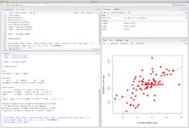

 
  
Installing R and RStudio
========================================================
  
  *Owen R. Jones*  
  _jones@biology.sdu.dk_

------
  
  
**R** is a programming language for data analysis and statistics. It is free and very widely used. One of its strengths is its very wide user base which means that there are hundreds of contributed packages for every concievable type of analysis. 

**RStudio** is an "integrated development environment" designed specifically for R. It is not essential to use it, but it makes programming and organising files much easier. I therefore recommend that you install it alongside R.

```{r comment = '>', tidy=TRUE, results='markup',eval=TRUE, echo=FALSE}
setwd("/Users/orj/Documents/StatsTeaching/IntroToR")
```

Installing R
-------------------------
  
  Go to [www.r-project.org](http://www.r-project.org), find the "*Download R*" link and click it. Select a nearby Mirror (i.e. Denmark), go to it, and download the appropriate version for your operating system. There are binaries available for MS Windows, Mac OSX and Linux. The latest version is R-3.1.1 which will run on Mac OS X 10.6 (Snow Leopard) or later, and MS Windows XP and later (including 64-bit versions of Windows).

* For the Windows version, click on "Download R for Windows", then click on "base". Then click on "Download R 3.1.1 for Windows". The installation file should then be downloaded.  Just run this for a Windows-style installer.

* For the Mac version, click on "Download R for (Mac) OS X". The Mac version is distributed as an installer package file, R-3.1.1.pkg, which can be installed by double-clicking. Be careful to pick the right version for your operating system (Mavericks, or Snow Leopard).

If you have an older operating system you may need to install one of the "legacy" binaries. Contact me if you have trouble with this.

Installing RStudio
-------------------------
  
  
  RStudio is an "integrated development environment" (IDE) for R. It provides a neat interface for R. It allows you to manage your projects and features syntax highlighting, integrated help files, support for producing plots in a number of formats. We will be using RStudio during the course. Like R it is free and open source.

Visit [http://www.rstudio.com/ide/](http://www.rstudio.com/ide/) and follow the links to download the recommended Desktop version.





```{r comment = '>', eval=TRUE, echo=FALSE}
system("pandoc -V papersize:\"a4paper\"  InstallingRandRStudio.md -o pdf/InstallingRandRStudio2.pdf")
```

