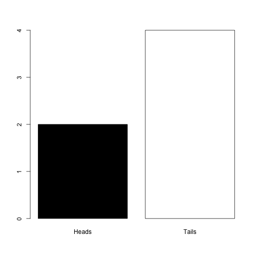
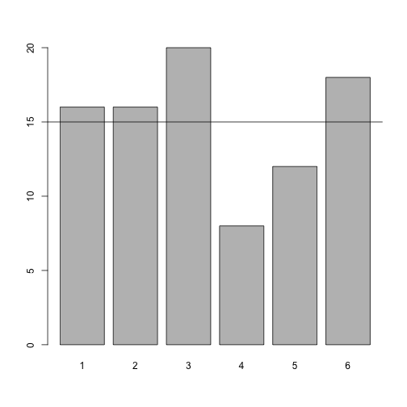

BB817 - Planning and evaluation of biological experiments
-------------------------

Law of Large Numbers
=============================
*Owen R. Jones*  
_jones@biology.sdu.dk_

------

The **law of large numbers** is one of the most important ideas in probability. It states that *As sample grows large, the sample mean converges to the population mean*. This worksheet shows how you can demonstrate this law using coin tosses or dice throws. Since it is tiresome to toss coins hundreds of times it is convenient to simulate the data using **R**. Conceptually, what we are trying to do here is treat the dice rolling/coin tossing as experiments where the aim is to find the probability of getting a head/tail, or a particular number on the dice. It is useful to use dice and coins because we are pretty sure that we know what the "true" answer is: the probability of throwing a 1 on a fair dice is 1/6, while the probability of throwing a head/tail with a flipped coin is 0.5.

----------

First, as a reminder from the Intro to R sessions, here's how to simulate a coin toss in R.

```r
coinToss <- c("Heads", "Tails")
sample(coinToss, 1)
```

[1] "Tails"


And here is how to simulate 6 coin tosses and make a table of the results. Note, we must use the *replace = TRUE* argument. Please ask if you don't understand why this is necessary.


```r
outcome = sample(coinToss, 6, replace = TRUE)
table(outcome)
```

```
> outcome
> Heads Tails 
>     3     3
```


We can wrap the **table** function with the **barplot** function to produce a simple barplot of the result (Figure 1). You'll probably get different results than me because this is a random process:

```r
outcome = sample(coinToss, 6, replace = TRUE)
barplot(table(outcome), col = c("black", "white"))
```

 

* Try this several times with small sample sizes and see what happens to the proportions of heads/tails. Consider what the expected outome should be. What do you notice?

* Now increase the sample size and see what happens to the proportions of heads/tails. Consider what the expected outome should be. What do you notice?


Virtual dice
=============================
Let's try the same kind of thing with the roll of (virtual) dice.

Here's how to do one roll of the dice:

```r
diceRoll <- 1:6
sample(diceRoll, 1)
```

[1] 1


Here's how to do 6 rolls of the dice:

```r
outcome = sample(diceRoll, 6, replace = TRUE)
table(outcome)
```

```
> outcome
> 2 3 4 5 6 
> 1 1 2 1 1
```


Now I try doing 1000 rolls of the dice. I can set a value for *n* (the number of rolls), and I can also plot a horizontal line at the theoretically expected value of n/6 (Figure 2):

```r
n = 90
outcome = sample(diceRoll, n, replace = TRUE)
barplot(table(outcome))
abline(h = n/6)
```

 


* Try adjusting the code to simulate dice rolls with small (say, 30) and large (say, 600, or 6000) samples. Observe what happens to the proportions, and compare them to the expected value.

* You will notice that what would be considered a good sample size for the coin flipping (i.e. it recovers the true probability of 0.5 reasonably well) is not adequate for getting a good estimate of the probabilities for the dice. This is because of the different number of possibilities: as the range of possible outcomes increases, the sample size requirements increase.


